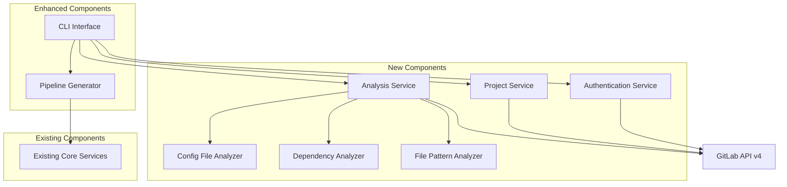

# Design Document

## Overview

The GitLab API Integration feature extends the existing GitLab Pipeline Generator with intelligent project analysis capabilities. The system will connect to GitLab's v4 API to automatically discover project properties, analyze codebase structure, and generate optimized CI/CD pipelines based on actual project characteristics rather than manual configuration alone.

## Architecture

### High-Level Architecture



### Component Integration

The new GitLab API integration components will integrate with the existing architecture:

- **CLI Layer**: Enhanced with new GitLab-specific options
- **Service Layer**: New GitLab services alongside existing pipeline generation services
- **Core Layer**: Existing pipeline generation logic remains unchanged, receives enhanced input from analysis

## Components and Interfaces

### 1. GitLab Authentication Service

**Interface: `IGitLabAuthenticationService`**

```csharp
public interface IGitLabAuthenticationService
{
    Task<GitLabClient> AuthenticateAsync(GitLabConnectionOptions options);
    Task<bool> ValidateTokenAsync(string token, string? instanceUrl = null);
    Task<GitLabUserInfo> GetCurrentUserAsync();
    void StoreCredentials(GitLabConnectionOptions options);
    GitLabConnectionOptions? LoadStoredCredentials();
    void ClearStoredCredentials();
}
```

**Responsibilities:**
- Handle GitLab API authentication using personal access tokens
- Support both gitlab.com and self-hosted GitLab instances
- Manage credential storage and retrieval
- Validate API connectivity and permissions

### 2. GitLab Project Service

**Interface: `IGitLabProjectService`**

```csharp
public interface IGitLabProjectService
{
    Task<GitLabProject> GetProjectAsync(string projectIdOrPath);
    Task<IEnumerable<GitLabProject>> ListProjectsAsync(ProjectListOptions options);
    Task<IEnumerable<GitLabProject>> SearchProjectsAsync(string searchTerm);
    Task<ProjectPermissions> GetProjectPermissionsAsync(int projectId);
    Task<bool> HasSufficientPermissionsAsync(int projectId, RequiredPermissions permissions);
}
```

**Responsibilities:**
- Retrieve project information from GitLab API
- List and search accessible projects
- Validate project permissions for analysis
- Handle project-related API operations

### 3. Project Analysis Service

**Interface: `IProjectAnalysisService`**

```csharp
public interface IProjectAnalysisService
{
    Task<ProjectAnalysisResult> AnalyzeProjectAsync(GitLabProject project, AnalysisOptions options);
    Task<ProjectType> DetectProjectTypeAsync(GitLabProject project);
    Task<BuildConfiguration> AnalyzeBuildConfigurationAsync(GitLabProject project);
    Task<DependencyInfo> AnalyzeDependenciesAsync(GitLabProject project);
    Task<DeploymentInfo> AnalyzeDeploymentConfigurationAsync(GitLabProject project);
}
```

**Responsibilities:**
- Orchestrate comprehensive project analysis
- Coordinate file pattern analysis, dependency analysis, and configuration analysis
- Aggregate analysis results into actionable pipeline configuration
- Handle analysis errors and partial results

### 4. File Pattern Analyzer

**Interface: `IFilePatternAnalyzer`**

```csharp
public interface IFilePatternAnalyzer
{
    Task<ProjectType> DetectProjectTypeAsync(IEnumerable<GitLabRepositoryFile> files);
    Task<FrameworkInfo> DetectFrameworksAsync(IEnumerable<GitLabRepositoryFile> files);
    Task<BuildToolInfo> DetectBuildToolsAsync(IEnumerable<GitLabRepositoryFile> files);
    Task<TestFrameworkInfo> DetectTestFrameworksAsync(IEnumerable<GitLabRepositoryFile> files);
}
```

**Responsibilities:**
- Analyze file patterns to determine project type
- Detect frameworks, build tools, and testing frameworks
- Identify project structure and organization patterns

### 5. Dependency Analyzer

**Interface: `IDependencyAnalyzer`**

```csharp
public interface IDependencyAnalyzer
{
    Task<DependencyInfo> AnalyzePackageFileAsync(string fileName, string content);
    Task<CacheConfiguration> RecommendCacheConfigurationAsync(DependencyInfo dependencies);
    Task<SecurityScanConfiguration> RecommendSecurityScanningAsync(DependencyInfo dependencies);
    Task<RuntimeInfo> DetectRuntimeRequirementsAsync(DependencyInfo dependencies);
}
```

**Responsibilities:**
- Parse package files (package.json, *.csproj, requirements.txt, etc.)
- Extract dependency information and version constraints
- Recommend caching strategies based on dependency patterns
- Suggest security scanning based on dependency types

### 6. Configuration File Analyzer

**Interface: `IConfigurationAnalyzer`**

```csharp
public interface IConfigurationAnalyzer
{
    Task<ExistingCIConfig> AnalyzeExistingCIConfigAsync(GitLabProject project);
    Task<DockerConfiguration> AnalyzeDockerConfigurationAsync(GitLabProject project);
    Task<DeploymentConfiguration> AnalyzeDeploymentConfigurationAsync(GitLabProject project);
    Task<EnvironmentConfiguration> DetectEnvironmentsAsync(GitLabProject project);
}
```

**Responsibilities:**
- Analyze existing CI/CD configurations
- Parse Docker configurations and deployment scripts
- Detect environment-specific configurations
- Extract deployment targets and strategies

## Data Models

### Core Data Models

```csharp
public class GitLabConnectionOptions
{
    public string? PersonalAccessToken { get; set; }
    public string? InstanceUrl { get; set; } = "https://gitlab.com";
    public string? ProfileName { get; set; }
    public bool StoreCredentials { get; set; } = false;
}

public class GitLabProject
{
    public int Id { get; set; }
    public string Name { get; set; }
    public string Path { get; set; }
    public string FullPath { get; set; }
    public string? Description { get; set; }
    public string DefaultBranch { get; set; }
    public DateTime LastActivityAt { get; set; }
    public ProjectVisibility Visibility { get; set; }
    public string WebUrl { get; set; }
}

public class ProjectAnalysisResult
{
    public ProjectType DetectedType { get; set; }
    public FrameworkInfo Framework { get; set; }
    public BuildConfiguration BuildConfig { get; set; }
    public DependencyInfo Dependencies { get; set; }
    public DeploymentInfo Deployment { get; set; }
    public ExistingCIConfig? ExistingCI { get; set; }
    public AnalysisConfidence Confidence { get; set; }
    public List<AnalysisWarning> Warnings { get; set; } = new();
}

public class FrameworkInfo
{
    public string Name { get; set; }
    public string? Version { get; set; }
    public List<string> DetectedFeatures { get; set; } = new();
    public Dictionary<string, string> Configuration { get; set; } = new();
}

public class BuildConfiguration
{
    public string BuildTool { get; set; }
    public List<string> BuildCommands { get; set; } = new();
    public List<string> TestCommands { get; set; } = new();
    public List<string> ArtifactPaths { get; set; } = new();
    public DockerConfiguration? Docker { get; set; }
}

public class DependencyInfo
{
    public List<PackageDependency> Dependencies { get; set; } = new();
    public List<PackageDependency> DevDependencies { get; set; } = new();
    public RuntimeInfo Runtime { get; set; }
    public CacheRecommendation CacheRecommendation { get; set; }
}
```

### Analysis Configuration Models

```csharp
public class AnalysisOptions
{
    public bool AnalyzeFiles { get; set; } = true;
    public bool AnalyzeDependencies { get; set; } = true;
    public bool AnalyzeExistingCI { get; set; } = true;
    public bool AnalyzeDeployment { get; set; } = true;
    public int MaxFileAnalysisDepth { get; set; } = 3;
    public List<string> ExcludePatterns { get; set; } = new();
    public bool IncludeSecurityAnalysis { get; set; } = true;
}

public class ProjectListOptions
{
    public bool OwnedOnly { get; set; } = false;
    public bool MemberOnly { get; set; } = true;
    public ProjectVisibility? Visibility { get; set; }
    public string? Search { get; set; }
    public ProjectOrderBy OrderBy { get; set; } = ProjectOrderBy.LastActivity;
    public int MaxResults { get; set; } = 50;
}
```

## Error Handling

### Error Categories and Handling Strategy

1. **Authentication Errors**
   - Invalid token: Clear error message with token generation instructions
   - Expired token: Prompt for token refresh
   - Insufficient permissions: List required permissions

2. **Network Errors**
   - Connection timeout: Retry with exponential backoff
   - Rate limiting: Implement respectful retry with delay
   - API unavailable: Graceful degradation to manual mode

3. **Analysis Errors**
   - File access errors: Continue with available files, warn about limitations
   - Parse errors: Log details, continue with partial analysis
   - Unsupported project types: Provide generic pipeline with warnings

4. **Configuration Errors**
   - Invalid project ID/path: Suggest search functionality
   - Missing required files: Provide recommendations for manual configuration
   - Conflicting configurations: Prioritize manual overrides with warnings

### Error Recovery Strategies

```csharp
public class GitLabApiErrorHandler
{
    public async Task<T> ExecuteWithRetryAsync<T>(Func<Task<T>> operation, RetryPolicy policy);
    public void HandleRateLimiting(RateLimitInfo rateLimitInfo);
    public string TranslateGitLabError(GitLabApiException exception);
    public bool ShouldFallbackToManualMode(Exception exception);
}
```

## Testing Strategy

### Unit Testing

1. **Service Layer Testing**
   - Mock GitLab API responses for various scenarios
   - Test authentication flows with different credential types
   - Validate project analysis logic with sample project structures
   - Test error handling and retry mechanisms

2. **Analysis Engine Testing**
   - Test file pattern recognition with various project types
   - Validate dependency parsing for different package managers
   - Test configuration analysis with sample config files
   - Verify pipeline generation based on analysis results

### Integration Testing

1. **GitLab API Integration**
   - Test against real GitLab instances (using test projects)
   - Validate API authentication and project retrieval
   - Test rate limiting and error handling
   - Verify analysis accuracy with known project structures

2. **End-to-End Pipeline Generation**
   - Test complete workflow from project analysis to pipeline generation
   - Validate generated pipelines against GitLab CI/CD syntax
   - Test hybrid mode (API analysis + manual overrides)
   - Verify fallback to manual mode when API is unavailable

### Test Data and Mocking

```csharp
public class GitLabApiMockService : IGitLabProjectService
{
    // Mock implementations for testing
    public Task<GitLabProject> GetProjectAsync(string projectIdOrPath)
    {
        // Return test project data based on test scenarios
    }
    
    // Additional mock methods...
}

public class TestProjectRepository
{
    public static GitLabProject GetSampleDotNetProject();
    public static GitLabProject GetSampleNodeJsProject();
    public static GitLabProject GetSamplePythonProject();
    // Additional test project generators...
}
```

### Performance Testing

1. **API Response Time Testing**
   - Measure analysis time for projects of various sizes
   - Test concurrent analysis operations
   - Validate caching effectiveness

2. **Memory Usage Testing**
   - Monitor memory usage during large project analysis
   - Test cleanup of temporary analysis data
   - Validate efficient handling of large file lists

## Security Considerations

### Credential Management

1. **Token Storage**
   - Use OS credential store (Windows Credential Manager, macOS Keychain, Linux Secret Service)
   - Encrypt stored tokens using DPAPI or equivalent
   - Provide option to disable credential storage

2. **API Communication**
   - Enforce HTTPS for all GitLab API communications
   - Validate SSL certificates
   - Implement request signing where applicable

### Data Privacy

1. **Project Data Handling**
   - Minimize data retention (analyze and discard)
   - Avoid logging sensitive project information
   - Respect project visibility settings

2. **Error Reporting**
   - Sanitize error messages to avoid exposing sensitive data
   - Provide option to disable detailed error reporting
   - Log security-relevant events appropriately

## Configuration and Deployment

### Configuration Management

```json
{
  "GitLab": {
    "DefaultInstanceUrl": "https://gitlab.com",
    "ApiVersion": "v4",
    "RequestTimeout": "00:00:30",
    "MaxRetryAttempts": 3,
    "RateLimitRespectful": true,
    "Analysis": {
      "MaxFileSize": 1048576,
      "MaxFilesAnalyzed": 1000,
      "SupportedFileExtensions": [".cs", ".js", ".ts", ".py", ".yml", ".yaml", ".json", ".xml"]
    }
  }
}
```

### CLI Integration

New CLI options will be added to support GitLab integration:

```bash
# GitLab connection options
--gitlab-token <token>          # Personal access token
--gitlab-url <url>              # GitLab instance URL
--gitlab-project <id-or-path>   # Project to analyze

# Analysis options
--analyze-project               # Enable automatic project analysis
--analysis-depth <level>        # Analysis depth (1-3)
--skip-analysis <types>         # Skip specific analysis types
--show-analysis                 # Display analysis results before generation

# Hybrid mode options
--prefer-detected               # Prefer detected settings over CLI options
--merge-config                  # Merge detected and manual configurations
--show-conflicts                # Show conflicts between detected and manual settings

# Project discovery options
--list-projects                 # List accessible projects
--search-projects <term>        # Search projects by name/description
--project-filter <filter>       # Filter projects by criteria
```

This design provides a comprehensive foundation for integrating GitLab API analysis capabilities while maintaining compatibility with the existing pipeline generation system.